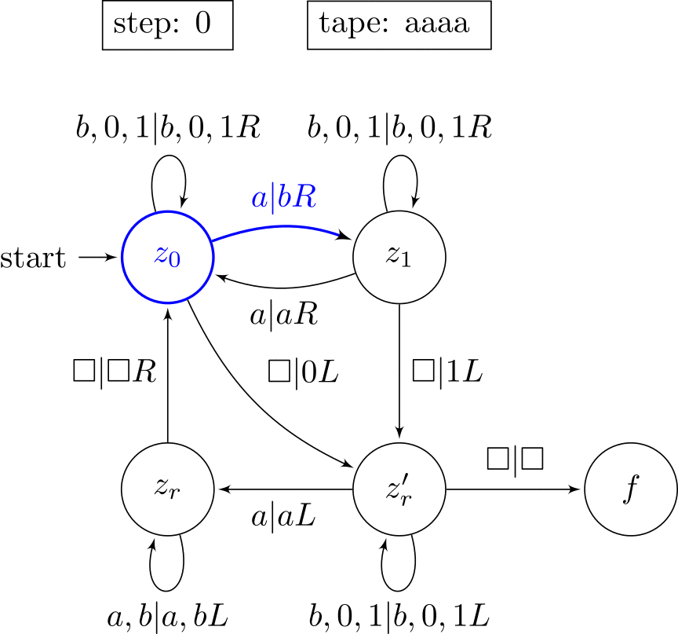

# Turing Machine Virtual Machine



> **WIP**: some features listed here are not yet implemented such as react and proper pdf output for example.

The idea is to make it easy to run **small** turing machines and visualize their state using tex.

You supply the data required to describe a *TM* (turing machine) and it will be turned into a tex document. This document will require some amount of clean-up in regards to positioning of nodes (states) and edges, but this file (after clean-up) will then be used as an input (along side the description of the TM) and will be used to generate pretty output for each state transition. This output can be a tex document, an svg, a png, a pdf for each state transition. There are also GIF
and react component outputs which aren't produced per state change.

## Usage

```
usage: ruby src/main.rb <optional flags> <input file>

flags:
  -o, --output     Specify the output format (tex, svg, png, gif, pdf, react, custom, default: svg)
  -t, --template   Specify the file that should be used as a template for the output
  -e, --expand     Expand aliases
  -E, --no-expand  Don't expand aliases
  -d, --duration   Duration between state transitions (ms)
  -v, --version    Print version
```

Check out the `input.tm` file for an example of how the turing machine needs to be specified

## Example

Run the example turing machine as follows:

```bash
ruby src/main.rb input.tm # generate the template from input.tm
$EDITOR input.tm.tex      # adjust the positioning of the states & edges
ruby src/main.rb --template input.tm.tex input.tm # generate the output from the template and input.tm
# output will be placed inside the `./output` directory
```

Most output formats have other output formats as a dependency:

- **svg** depends on **tex**
- **png** depends on **svg** (and thereby also tex)
- **gif** depends on **png** (and thereby also tex, svg)
- **pdf** depends on **tex**
- **react** depends on **tex**

Outputting to gif results in the outputs for tex, svg, png and gif to be generated and similar for all other output formats.

> Outputting to png (and thereby also gif) is a bit slow duo to inkscape having to be launched individually each time.

> the option 'custom' at the moment just prints out the state of the turing machine when each step is executed, it does not generate any output. This state is formatted as a ruby hash. In the future it will be more customizable and flexible and allow things such as executing external programs each step. This option is currently mostly used for debugging output when generating a ton of files is a little too slow.

## Features

there are many macros that can be used inside of the tex template file:

- `\TMVMCURRSTATE`: the current state
- `\TMVMCURRSYMBOL`: the current symbol to be processed
- `\TMVMCOMPLETEINPUT`: the complete input (initial state of tape)
- `\TMVMCOMPLETETAPE`: the current state of the tape
- `\TMVMSTEP`: the step that is currently being executed

Alongside those macros it is also possible to modify how the highlighting of the active state / transition looks

For that simply modify the `n_highlight` and `e_highlight` styles:

```latex
\tikzstyle{n_highlight}=[draw=blue,text=blue]
\tikzstyle{e_highlight}=[draw=blue,text=blue]
```

## Requirements

- ruby
- a latex* distribution (when outputting to anything other than tex)
- dvisvgm* (when outputting to anything other than tex)
- inkscape* (when outputting to png)
- imagemagick (when outputting to gif)

> *latex*: [BasicTex](https://tug.org/mactex/morepackages.html) is a pretty light weight latex distribution for macOS
>
> *dvisvgm*: Can be difficult to install on macOS, [this](https://gist.github.com/tobywf/aeeeee63053aaaa841b4032963406684) script can help with that (some modifications need to be made for it to work properly)
>
> *inkscape*: [inkscape 0.9x for macOS is a 32 bit app and, starting with Catalina, no longer supported by macOS](https://inkscape.org/news/2019/11/10/macos-1015-catalina-support/). There is a development release of Inkscape 1.0 available.
